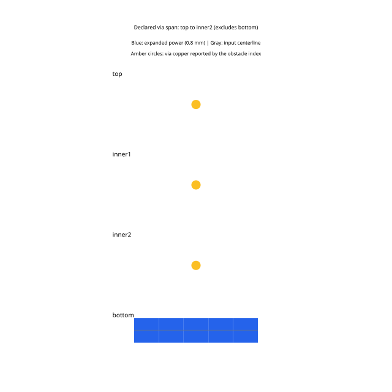
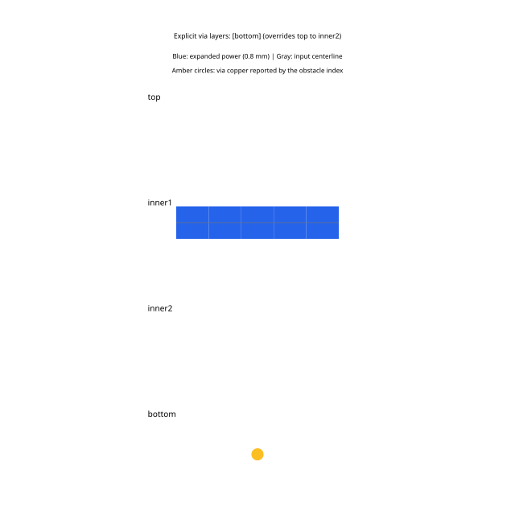

# Via-span obstacle reproduction

One straight 0.1 mm power trace requests expansion to 0.8 mm. One immutable 0.3 mm via belongs to a different net and does not occupy the power trace's layer.

- **Endpoint span:** the via declares `top` to `inner2` on a four-layer board; the power trace is on `bottom`.
- **Explicit layers:** the via declares `layers: ["bottom"]` alongside `top`/`inner2` endpoint metadata; the power trace is on `inner1`.

The reproduction in [PR #26](https://github.com/tscircuit/power-trace-expander/pull/26) bends both power traces because the obstacle index puts every via on every layer. With the fix, via obstacles occupy only the declared layers and both traces expand straight to 0.8 mm. The tests and these same snapshots now assert that corrected behavior.

Each panel is one board layer. Amber circles show **the actual obstacle index's via geometry**, using its declared layers. Blue is the solver's expanded output at its physical width; the gray dashed line is the input centerline. The declared via layers are printed above the panels.

Run the reproductions with:

```sh
bun test tests/via-span-endpoints-reproduction.test.ts tests/via-span-layers-reproduction.test.ts --timeout 9999999
```

Open `via-span-obstacles/via-span-obstacles` in the solver debugger for interactive views of both cases.




